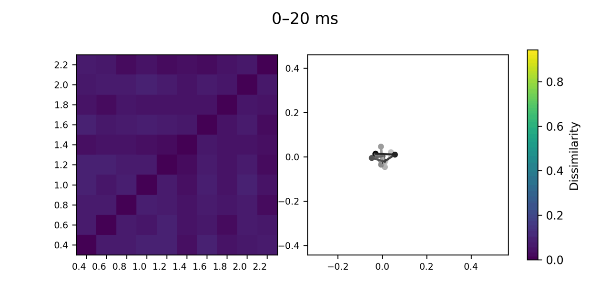

## Abstract

Is there a geometry of time in the human mind? A canonical measure of time in psychology is duration, a time interval quantifiable as a magnitude. Durations have been proposed to be arranged along a mental timeline: a unidimensional, linear, and spatialised representation of time. Here, we asked whether such a mental timeline is sufficient to account for the experience of duration. To address this, we tested the same participants in two experiments: a behavioural similarity judgment task, in which participants rated the similarity of duration pairs, and an electroencephalography (EEG) experiment in which they detected oddball durations in a sequence. Behavioural and EEG data were used to construct representational dissimilarity matrices, whose geometry was compared against theoretical models of duration organisation. Our results reveal that most variance in behavioural similarity judgements is explained by three latent dimensions, interpretable as: magnitude (monotonic ordering of durations), contextual encoding (distance to the geometric mean of the duration set), and a periodic component. These three dimensions are jointly consistent with a latent generalised helical model, which provided excellent fit to the behavioural data. Individual helical model parameters further correlated with endogenous neural oscillations measured during rest, suggesting that an individual’s duration space is partially constrained by intrinsic dynamics. The neural geometry was also found to be dynamic, unfolding in two successive stages: a strong logarithmic encoding of durations peaking around 150 ms after duration offset, followed by a spring-like geometry starting around 300 ms after offset. Together, these findings describe multidimensional psychological and neural geometries of duration space, and characterise their relationship.

## Visualisations

This animated figure illustrates the time-resolved evolution of the neural geometry of duration space following stimulus offset.

<em>Dynamics of the neural geometry of duration space at stimulus offset.</em> For successive 40-ms time windows from stimulus offset to 600 ms after offset, the left panel shows the group-average EEG representational dissimilarity matrix (RDM), and the right panel the corresponding 2D MDS solution.
